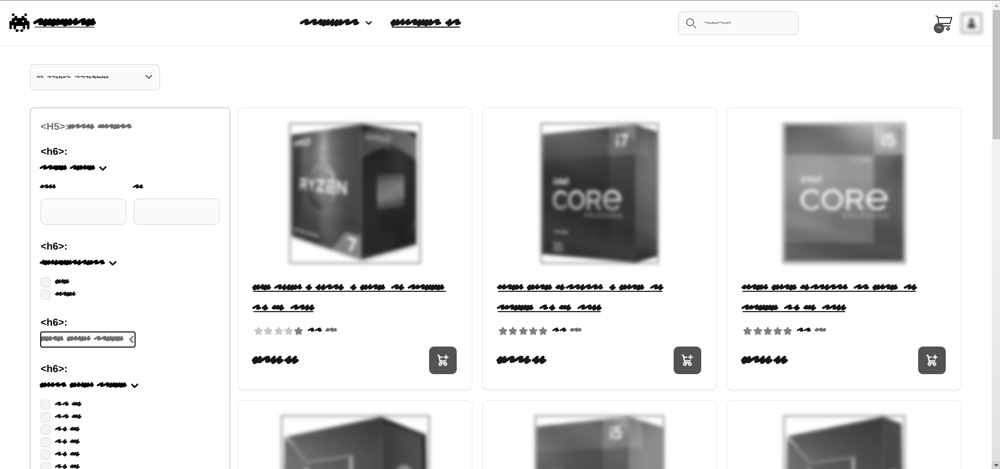
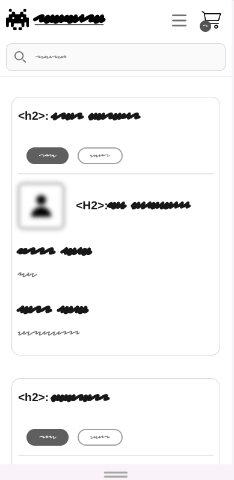
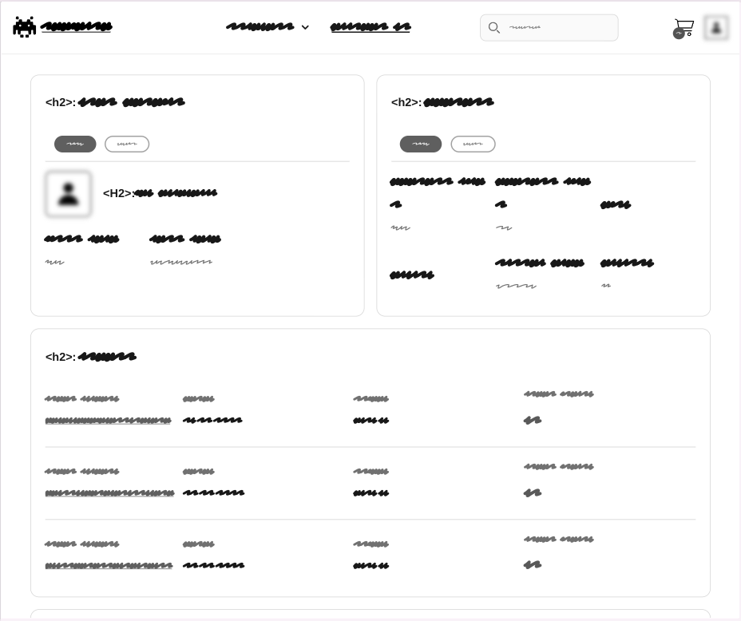
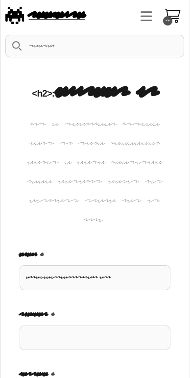
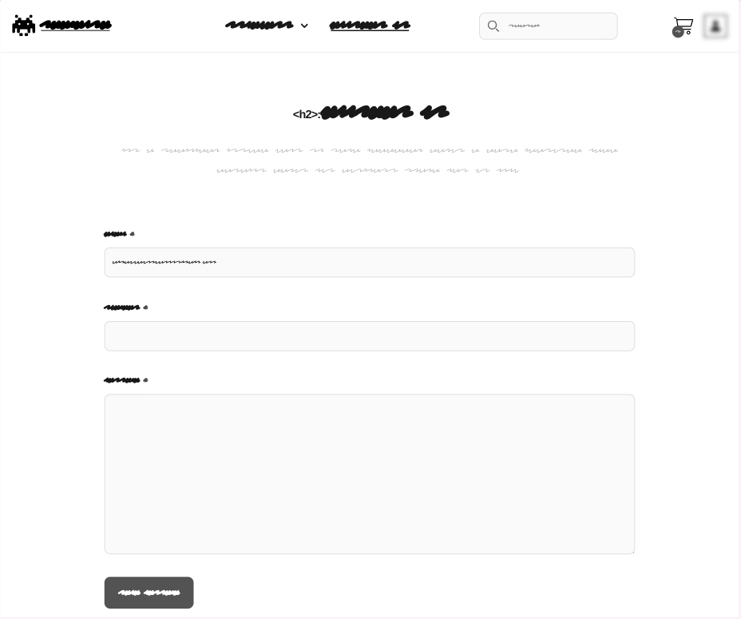

# TechCore (Milestone Project 5)


## Table of contents

-   [Purpose](#purpose)
-   [UX Design](#ux-design)
    -   [Epics](#epics)
    -   [User and Developer Stories](#user-and-developer-stories)
-   [Wireframes](#wireframes)
    -   [Welcome page](#welcome-page)
    -   [Home page](#home-page)
    -   [Profile page](#profile-page)
    -   [Dictionary page](#dictionary-page)
    -   [Form page](#form-page)
-   [Agile Development](#agile-development)
    -   [Task Management](#task-management)
    -   [Project Management](#project-management)
    -   [Workflow](#workflow)
-   [Design](#design)
    -   [Color Scheme](#color-scheme)
    -   [Typography](#typography)
-   [Features](#features)
    -   [User Registration and Authentication](#user-registration-and-authentication)
    -   [Dictionary Management](#dictionary-management)
    -   [Backend and API Integration](#backend-and-api-integration)
    -   [User Profile and Notifications](#user-profile-and-notifications)
    -   [Dynamic and Interactive Features](#dynamic-and-interactive-features)
-   [Database Schema](#database-schema)
-   [Testing](#testing)
    -   [Manual Testing](#manual-testing)
        -   [Navbar](#navbar)
        -   [Footer](#footer)
        -   [Home page](#home-page-1)
        -   [Dictionary page](#dictionary-page-1)
        -   [Profile page](#profile-page-1)
        -   [Forms](#forms)
    -   [Unit testing](#unit-testing)
        -   [Python unit tests](#python-unit-tests)
        -   [JS unit tests](#js-unit-tests)
    -   [Code validation](#code-validation)
        -   [HTML Validation](#html-validation)
        -   [CSS Validation](#css-validation)
        -   [Python Validation](#python-validation)
        -   [JS Validation](#js-validation)
    -   [Lighthouse](#lighthouse)
-   [Technologies](#technologies)
    -   [Languages](#languages)
    -   [Programs, frameworks, libraries](#programs--frameworks--libraries)
-   [Environment Variables](#environment-variables)
-   [Deployment](#deployment)
    -   [Heroku](#heroku)
    -   [Clone GitHub Repo](#clone-github-repo)
-   [Bugs](#bugs)
-   [Credits](#credits)
    -   [Media](#media)
    -   [Design Template](#design-template)
    -   [Code](#code)
    -   [Acknowledgements](#acknowledgements)

<small><i><a href='http://ecotrust-canada.github.io/markdown-toc/'>Table of contents generated with markdown-toc</a></i></small>

# Purpose

TechCore is an e-commerce platform built with the Django framework, designed to provide a seamless shopping experience for tech enthusiasts looking for high-performance CPUs and GPUs. Leveraging Django's powerful backend capabilities, the application features user authentication, efficient data management, and precise routing for a smooth and secure shopping journey. The frontend is enriched with Django’s templating system and HTMX for interactive and dynamic content updates, reducing page reloads and improving responsiveness.

Key features include a customizable price range filter, easy product browsing, a streamlined checkout process with Stripe integration, and a flexible cart system. These features are crafted to deliver a user-friendly and efficient shopping experience, catering to both casual tech shoppers and performance-focused enthusiasts.

[Table of contents](#table-of-contents)

# UX Design

-   **PC Builders and Gamers**: Individuals who are building or upgrading custom PCs, especially gamers seeking high-performance components. TechCore offers a curated selection of CPUs and GPUs to meet their specific needs.

-   **Tech Enthusiasts and Professionals**: Users interested in the latest advancements in computer hardware, including programmers, designers, and engineers who need powerful processors and graphics cards for intensive tasks.

-   **Retail and Wholesale Buyers**: Businesses or individual buyers looking for reliable sources for bulk or retail purchases of CPUs and GPUs, with streamlined shopping features and flexible order quantities.

-   **Price-Conscious Shoppers**: Users looking to find the best hardware within their budget range. TechCore’s price range filter allows them to explore options tailored to their budget.

## Epics

## User and Developer Stories

-   **User stories:**

-   **Developer stories:**

[Back to the top](#table-of-contents)

# Wireframes

## Home page

-   <details>
      <summary>Mobile</summary>
      
    </details>

-   <details>
      <summary>Laptop</summary>
      
      alt="Laptop wire frame">
    </details>

## Profile page

-   <details>
      <summary>Mobile</summary>
      
    </details>

-   <details>
      <summary>Laptop</summary>
      
      alt="Laptop wire frame">
    </details>

## Form page

-   <details>
      <summary>Mobile</summary>
      
    </details>

-   <details>
      <summary>Laptop</summary>
      
      alt="Laptop wire frame">
    </details>

[Back to the Top](#help-u-website-milestone-project-4)

# Agile Development

In this project, we use Agile methodology to manage and track development tasks. Here's a breakdown of how we apply Agile practices:

## Task Management

-   **Issues**: Each task is represented by an issue in our GitHub repository.
-   **Labels**: Issues are categorized using labels to indicate their priority and importance:
    -   `Could Have`
    -   `Must Have`
    -   `Should Have`
    -   `Would Have`
-   **Milestones**:
    -   **Product Backlog**: This milestone includes all issues that have been identified but not yet assigned to a specific iteration. Issues in this milestone do not have time constraints.
    -   **Iteration #number**: Each iteration has a specific duration (one week) and is assigned a milestone. Issues are moved to this milestone as they are scheduled for the current iteration.

## Project Management

-   **GitHub Kanban Board**: We use a GitHub Kanban board to represent the current iteration's state and to track progress. Each iteration has its own project board.
-   **Iteration Planning**: For each new iteration, a new project board is created. Each iteration consists of a specific number of issues that are planned for completion within the week.

## Workflow

1. **New Issues**: All new issues are added to the `Product Backlog` milestone by default.
2. **Iteration Setup**: When a new iteration begins, a new project board is created, and issues from the `Product Backlog` are selected and moved to the corresponding `Iteration #number` milestone.
3. **Execution**: During the iteration, the team works on issues as per the priority labels and tracks progress on the GitHub Kanban board.
4. **Review**: At the end of each iteration, completed issues are reviewed, and a new iteration is planned with updated priorities and tasks.

This structured approach ensures clear task prioritization and efficient tracking of progress throughout the development cycle.

# Design

## Color Scheme

This color scheme was chosen to create a clean and modern look for the website.


## Typography

This project uses the following Google Font:

-   [Inter](https://fonts.google.com/specimen/Inter) - for all text content.

[Back to the top](#table-of-contents)

# Features

## User Registration and Authentication

This project utilizes the Django allauth library to handle user registration, authentication, and account management, including social account integration.

-   **Registration and Authentication with Social Accounts**: Allows users to sign up and log in using social accounts.
-   **User Registration**: Enables new users to create an account with their details.
-   **User Login**: Provides users with the ability to log in using their credentials.
-   **User Logout**: Allows users to log out from their accounts.
-   **Reset Password**: Facilitates the process for users to reset their forgotten passwords.
-   **Change Password**: Allows users to change their account passwords.
-   **Set Password**: Allows users to set a password for their account if they sign up with their social account.
-   **Email Confirmation**: Sends a confirmation link to the user's email to verify that the email address belongs to the user.
-   **User Account Deletion**: Allows users to permanently delete their accounts.
-   **Admin Model Registration**: Registers models in the Django Admin interface for administrative purposes.

## User Profile and Notifications

-   **User Profile**: Provides users with a profile page where they can view and update their personal information.
-   **Success and Error Toast Notifications**: Displays toast messages to inform users of success or errors during interactions.

# Database Schema

The first schema is for the dictionary app, which includes models for dictionaries, words, and translations. The second schema is for the entire project, which includes models for user profiles, user dictionaries, and user translations.

<details>
  <summary>Database Schema of dictionary app</summary>
  
</details>

<details>
  <summary>Database Schema of whole project</summary>
  
</details>

[Back to the top](#table-of-contents)

# Testing

## Manual Testing

### Navbar

-   :heavy_check_mark: Navbar layout displays correctly on different screen sizes.
-   :heavy_check_mark: All links are working correctly.
-   :heavy_check_mark: The burger menu functions correctly on mobile devices.
-   :heavy_check_mark: Anonymous users do not see links that are only for authenticated users.

### Footer

-   :heavy_check_mark: Footer layout displays correctly on different screen sizes.
-   :heavy_check_mark: All links are working correctly.
-   :heavy_check_mark: The link to the GitHub repo opens in a new tab.

### Home page

-   For anonymous users:

-   For authenticated users:

### Profile page

-   For anonymous users:

    -   :heavy_check_mark: Get redirect to the welcome page.

-   For authenticated users:
    -   :heavy_check_mark: All links are working correctly.
    -   :heavy_check_mark: The dictionary page displays correctly on different screen sizes..
    -   :heavy_check_mark: User can change the password.
    -   :heavy_check_mark: User can delete the account.
    -   :heavy_check_mark: User can seen general information about his account.
    -   :heavy_check_mark: User can see amount of his dictionaries and delete them.

### Forms

All forms were created using one template so that they have the same styles and functionality. An anonymous user can see all forms except **Set Password**, **Change Password**, and **Create Dictionary** forms.

-   For all users:
    -   :heavy_check_mark: All forms are displayed correctly on different screen sizes.
    -   :heavy_check_mark: All form fields, buttons, and hints work correctly.

[Back to the top](#table-of-contents)

## Unit testing

### Python unit tests

Unit tests was create with django built-in django test functionality. To run the tests, run the following command in the terminal:

```bash
python manage.py test
```

<details>
  <summary>Test results:</summary>
  
</details>

<details>
  <summary>Test coverage:</summary>
  
</details>

### JS unit tests

JS unit testing was performed through [Jest](https://jestjs.io/). To run the tests, run the following command in the terminal:

```bash
npm test wordnest/static/js/__tests__/
```

<details>
  <summary>Test results:</summary>
  
</details>

[Back to the top](#table-of-contents)

## Code validation

### HTML Validation

To validate the HTML code, I use the [W3C HTML Markup Validator](https://validator.w3.org/#validate_by_uri). Since I use htmx in my project, the validator will show some errors related to the htmx attributes, but these can be ignored.

-   :heavy_check_mark: [Home page](https://validator.w3.org/nu/?showsource=yes&doc=https%3A%2F%2Fwordnest-f67ad8aa67ee.herokuapp.com%2F)

### CSS Validation

To validate the CSS code, I use the [W3 Jigsaw validator](https://jigsaw.w3.org/css-validator/#validate_by_uri).

-   :heavy_check_mark: [style.css, normalize.css](https://jigsaw.w3.org/css-validator/validator?uri=https%3A%2F%2Fwordnest-f67ad8aa67ee.herokuapp.com%2F&profile=css3svg&usermedium=all&warning=1&vextwarning=&lang=en)

### Python Validation

To validate the Python code I use [Ruff](https://docs.astral.sh/ruff/) VScode extension.

-   :heavy_check_mark: No errors found.

### JS Validation

To validate the JS code I use [ESLint] VScode extension(https://eslint.org/).

-   :heavy_check_mark: No errors found.

[Back to the top](#table-of-contents)

## Lighthouse

-   :heavy_check_mark: [Welcome page](https://pagespeed.web.dev/analysis/https-wordnest-f67ad8aa67ee-herokuapp-com/7bjo7sh6r5?form_factor=mobile)

-   <details>
      <summary>Home page</summary>
      
    </details>

-   :heavy_check_mark: [Register page](https://pagespeed.web.dev/analysis/https-wordnest-f67ad8aa67ee-herokuapp-com-accounts-signup/q9mozw7reu?form_factor=desktop)

[Back to the top](#table-of-contents)

# Technologies

## Languages

-   Python+Django, JavaScript, HTML, CSS

## Programs, frameworks, libraries

-   [Django](https://www.djangoproject.com/) for backend and frontend functionality.
-   [PostgreSQL](https://www.postgresql.org/) relational database.
-   [Psycopg](https://www.psycopg.org/) PostgreSQL adapter for Python.
-   [Google Fonts](https://fonts.google.com/) for typography.
-   [GitHub](https://GitHub.com/) to host the source code.
-   [Heroku](https://www.heroku.com/) to deploy and host the live app.
-   [Jest](https://jestjs.io/) for JS unit-testing.
-   [Unittest](https://docs.python.org/3/library/unittest.html) for Python unit-testing.
-   [W3C HTML Markup Validator](https://validator.w3.org/) to validate HTML code.
-   [W3C Jigsaw CSS Validator](https://jigsaw.w3.org/css-validator/) to validate CSS code.
-   [django-allauth](https://docs.allauth.org/en/latest/introduction/index.html) - help to set up social authentication.
-   [dj-database-url](https://github.com/jazzband/dj-database-url/) - allows to use URLs to connect to DB
-   [js-cookie](https://github.com/js-cookie/js-cookie/) - JavaScript API for handling cookies
-   [django-htmx](https://django-htmx.readthedocs.io/en/latest/index.html) - make using htmx in Django easier.

[Back to the top](#table-of-contents)

# Environment Variables

To run this project locally, you will need to create a `.env` file in the root directory of the project and add the following environment variables:

```bash
SECRET_KEY=your_django_secret_key
DEBUG=True
DB_NAME=
DB_USER=
DB_PASSWORD=
DB_HOST=
DB_PORT=
GOOGLE_CLIENT_ID=
GOOGLE_CLIENT_SECRET=
FACEBOOK_CLIENT_ID=
FACEBOOK_CLIENT_SECRET=
```

`GOOGLE_CLIENT_ID, GOOGLE_CLIENT_SECRET, FACEBOOK_CLIENT_ID, FACEBOOK_CLIENT_SECRET` used for user social authentication.

# Deployment

## Heroku

The WordNest project was deployed on a Heroku hosting server. The following steps outline the process of deploying the WordNest project and can be applied to deploy another Django project with minor adjustments:

1.  Navigate to your [Heroku dashboard](https://dashboard.heroku.com/apps) and create a new app with a unique name.

2.  Navigate to **Settings** in [Heroku dashboard](https://dashboard.heroku.com/apps) and click **Add buildpacks** and choose "nodejs". This buildpack is required to be at te top of the buildpack list.

3.  Install `gunicorn` as a production-ready webserver for Heroku with command.

    ```
    pip install gunicorn
    ```

4.  Create a file named `Procfile` at the root directory of the project.

5.  Add following command to `Procfile` to run your server in production.

    ```
    web: gunicorn wordnest.wsgi
    ```

    <sub>**Note**: Replace `wordnest` with your project name</sub>

6.  In the `settings.py` file update the `ALLOWED_HOSTS` variable.

    ```python
    ALLOWED_HOSTS = ['127.0.0.1', '.herokuapp.com']
    ```

7.  Install [dj-database-url](https://pypi.org/project/dj-database-url/).

    ```
    pip install dj-database-url
    ```

8.  Import `dj-database-url` in `settings.py`.

    ```python
    import dj_database_url
    ```

9.  Install [psycopg3](https://pypi.org/project/psycopg/) to connect to PostgreSQL database.

    ```
    pip install "psycopg[binary,pool]"
    ```

10. In the `settings.py` replace `DATABASES` with the following code:

    ```python
    if DEBUG:
        DATABASES = {
        "default": {
            "ENGINE": "django.db.backends.postgresql",
            "NAME": config("DB_NAME"),
            "USER": config("DB_USER"),
            "PASSWORD": config("DB_PASSWORD"),
            "HOST": config("DB_HOST"),
            "PORT": config("DB_PORT"),
            }
        }
    else:
        DATABASES = {
            'default': dj_database_url.parse(config('DATABASE_URL'))
        }
    ```

    <sub>**Note**: Replace `if` clause with your own database for local development</sub>

11. In the `.env` file update the `DEBUG` environment variable and add `DATABASE_URL` new one.

    ```
    DEBUG=False
    DATABASE_URL=add_URL_of_a_remote_database
    ```

    <sub>**Note**: For the WordNest I used database URL provided by `Code Institute` but you can use other database hosting services< such as [Amazon RDS for PostgreSQL](https://aws.amazon.com/rds/postgresql/)/sub>

12. **Reload your terminal** and run the following command in **terminal** to migrate remote database.

    ```
    python manage.py migrate
    ```

13. Replace `DEBUG=False` to `DEBUG=True` in the `.env` file.

14. Return to the [Heroku dashboard](https://dashboard.heroku.com/apps/wordnest) navigate to the **Settings** tab and click on **Reveal Config Var** and add `DATABASE_URL` environment variable.

15. Install [whitenoise](https://pypi.org/project/whitenoise/) to manage static files on production server.

    ```
    pip install whitenoise
    ```

16. Add `whitenoise` to the `MIDDLEWARE` list in the `settings.py`.

    ```python
    MIDDLEWARE = [
        "django.middleware.security.SecurityMiddleware",
        'whitenoise.middleware.WhiteNoiseMiddleware',
    ]
    ```

    <sub>**Note**: The WhiteNoise middleware must be placed directly after the Django `SecurityMiddleware`</sub>

17. Add `STATIC_ROOT` and `STORAGES` variables to the `settings.py`.

    ```python
    STORAGES = {
        "staticfiles": {
            "BACKEND": "whitenoise.storage.CompressedManifestStaticFilesStorage",
        },
    }
    STATIC_ROOT = BASE_DIR.joinpath("staticfiles")
    ```

18. Run the following command in **terminal** to collect static files.

    ```
    python manage.py tailwind build
    python manage.py collectstatic
    ```

19. From the terminal, check the Python version used in your IDE.

    ```
    python --version
    ```

20. Look up the [supported runtimes here](https://devcenter.heroku.com/articles/python-support#specifying-a-python-version) and copy the runtime closest to the one used in your IDE.

21. Add a `runtime.txt` file to your app's root directory.

22. Paste the copied runtime into the `runtime.txt` file.

23. Update `requirements.txt`.

    ```
    pip freeze > requirements.txt
    ```

24. Add and commit all changes to the repository.

    ```
    git add .
    git commit -m "Deploying to Heroku"
    ```

25. Push the changes to your remote branch that you intend to deploy.

    ```
    git push
    ```

26. On the [Heroku dashboard](https://dashboard.heroku.com/apps), and in your app, click on the **Deploy** tab.

27. In the **Deployment method** section enable GitHub integration by clicking on **Connect to GitHub**.

28. Start typing your project repo name into the search box and click **Search**. A list of repositories from your GitHub account should appear. Click on the GitHub repo you want to deploy from.

29. Scroll to the bottom of the page in the **Manual deploy** section, choose branch you want to deploy and click **Deploy Branch** to start a manual deployment of the branch.

30. Open the **Resources** tab and choose an eco dyno. This dyno is a lightweight container to run your project.

31. Verify there is no existing Postgres database **add-on**. if there is a database add-on select **Delete Add-on** to remove it.

32. Click on **Open app** to view your deployed project.

[Back to the top](#table-of-contents)

## Clone GitHub Repo

1.  Log into your account on GitHub
2.  Go to the repository of this project [WordNest](https://github.com/Dima-Bulavenko/wordnest)
3.  Click on the **code** button, and copy your preferred clone link.
4.  Open the terminal in your code editor and change the current working directory to the location you want to use for the cloned directory.
5.  Type `git clone` into the terminal, paste the link you copied in step 3 and press enter.

[Back to the top](#table-of-contents)

# Bugs

-   All fixed bugs can be found [here]()

-   All unfixed bugs can be found [here]()

[Back to top](#contents)

# Credits

## Media

-   icons from [Font Awesome](https://fontawesome.com/)

[Back to the top](#table-of-contents)

## Design Template

-   [Animated burger menu](https://codepen.io/ainalem/pen/GeMqdP)

-   [Layout of shopping cart page](https://flowbite.com/blocks/e-commerce/shopping-cart/)

[Back to the top](#table-of-contents)

## Code

-   [Implementing infinite scroll in Django with htmx](https://medium.com/@franciscovcbm/infinite-scroll-with-django-and-htmx-27f61cfaf911)

-   [Dynamic messages with HTMX and Alpine.js](https://danjacob.net/posts/htmx_messages/)

-   [django-tailwind build on heroku](https://medium.com/@phuitsing/heroku-buildpack-for-django-tailwind-de96be543f9)

[Back to the top](#table-of-contents)

## Acknowledgements

I want to convey my immense gratitude to my mentor, [Luke Buchanan](https://www.linkedin.com/in/lukebuchanan67/), for pinpointing my mistakes and providing advice on how to rectify them. Special thanks to my friends who assisted in testing the application, and to the Slack community, always ready to offer valuable tips at any time.

[Back to the top](#table-of-contents)
